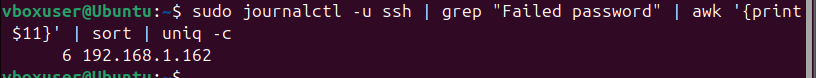
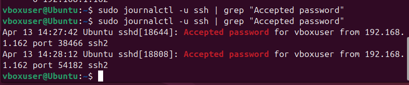

# SSH Brute Force Attack & Detection using Hydra (Two VM Lab)

## Objective
Simulate a real-world SSH brute-force attack from an attacker machine (Kali Linux) to a target machine (Ubuntu) and detect it using system logs (`journalctl`).

---

## Lab Architecture

Kali (Attacker) → Ubuntu (Target)

192.168.1.162 → 192.168.1.7

Both machines are configured in the same network (Bridged Adapter).

---

## Tools Used

- Kali Linux (Attacker)
- Ubuntu (Target)
- Hydra
- OpenSSH Server
- journalctl (systemd logs)

---

## Target Setup (Ubuntu)

### Check IP Address

Command: ip a

[Ubuntu IP] (Screenshots/1. Ubuntu IP.png)

---

### Verify SSH Service

Command: sudo systemctl status ssh

[SSH Status] (Screenshots/2. checking SSH on Ubuntu.png)

---

## Connectivity Verification (Kali → Ubuntu)

### Ping Test

Command: ping 192.168.1.7 -c 5

[Ping Test] (Screenshots/3. Connectivity kali to ubuntu.png)

---

### Port Scan (SSH Open)

Command: nc -zv 192.168.1.7 22

[SSH Port] (Screenshots/4. SSH open.png)

---

## Wordlist Creation (Kali)

Command: nano pass.txt

[Wordlist] (Screenshots/5. Wordlist.png)

---

## Live Log Monitoring (Ubuntu)

Command: sudo journalctl -u ssh -f

[Live Logs] (Screenshots/6. Live Logs.png)

---

## Brute Force Attack (Hydra)

Command: hydra -l vboxuser -P pass.txt -t 4 -V ssh://192.168.1.7

[Hydra Attack] (Screenshots/7. Hydra Attack.png)

---

## Detection & Analysis (Ubuntu)

## Live Detection During Attack

Command: sudo journalctl -u ssh -f

[Live Detection] (Screenshots/8. Live Detection.png)

---

## Failed Login Attempts

Command: sudo journalctl -u ssh | grep "Failed password"

[Failed Attempts] (Screenshots/9. Failed Attempts.png)

---

## Count Failed Attempts

Command: sudo journalctl -u ssh | grep "Failed password" | wc -l

[Failed Count] (Screenshots/10. Failed Password Count.png)

---

## Identify Attacker IP

Command: sudo journalctl -u ssh | grep "Failed password" | awk '{print $11}' | sort | uniq -c

---

## Successful Login Detection

Command: sudo journalctl -u ssh | grep "Accepted password"

---

## Attack Flow

1. Attacker identifies SSH service
2. Creates password wordlist
3. Launches Hydra brute-force attack
4. Target system logs failed attempts
5. Successful login detected (if password matches)
6. SOC analyzes logs for compromise

---

## Findings

Multiple failed login attempts detected

Attacker IP identified: 192.168.1.162

Target user: vboxuser

Successful login observed after brute-force attempts

---

## SOC Analysis

The attack demonstrates a dictionary-based brute-force attempt against SSH.

Indicators observed:

- Multiple failed authentication attempts
- Same source IP across attempts
- High frequency login attempts
- Successful authentication after failures
This pattern indicates:

⚠️ Potential credential compromise and unauthorized access

Such behavior should trigger alerts in a SOC environment and requires immediate investigation.

---

## Incident Response

- Severity: High
- Action Taken:
  - Identified attacker IP
  - Verified compromised account
  - Recommended account lock/reset
  - Suggested IP blocking and monitoring

## MITRE ATT&CK Mapping

T1110 — Brute Force

T1078 — Valid Accounts

---

## Recommendations

Disable password authentication for SSH

Use SSH key-based authentication

Implement fail2ban

Enforce strong password policies

Monitor authentication logs via SIEM

---

## Conclusion

This lab demonstrates a complete attack and detection cycle:

Real attacker (Kali)

Real target (Ubuntu)

Real brute-force attack (Hydra)

Real-time detection using logs

This reflects a real-world SOC investigation workflow.

---

## Skills Demonstrated

- Log Analysis (Linux / journalctl)
- Threat Detection
- Brute Force Attack Analysis
- Incident Investigation
- MITRE ATT&CK Mapping

---
